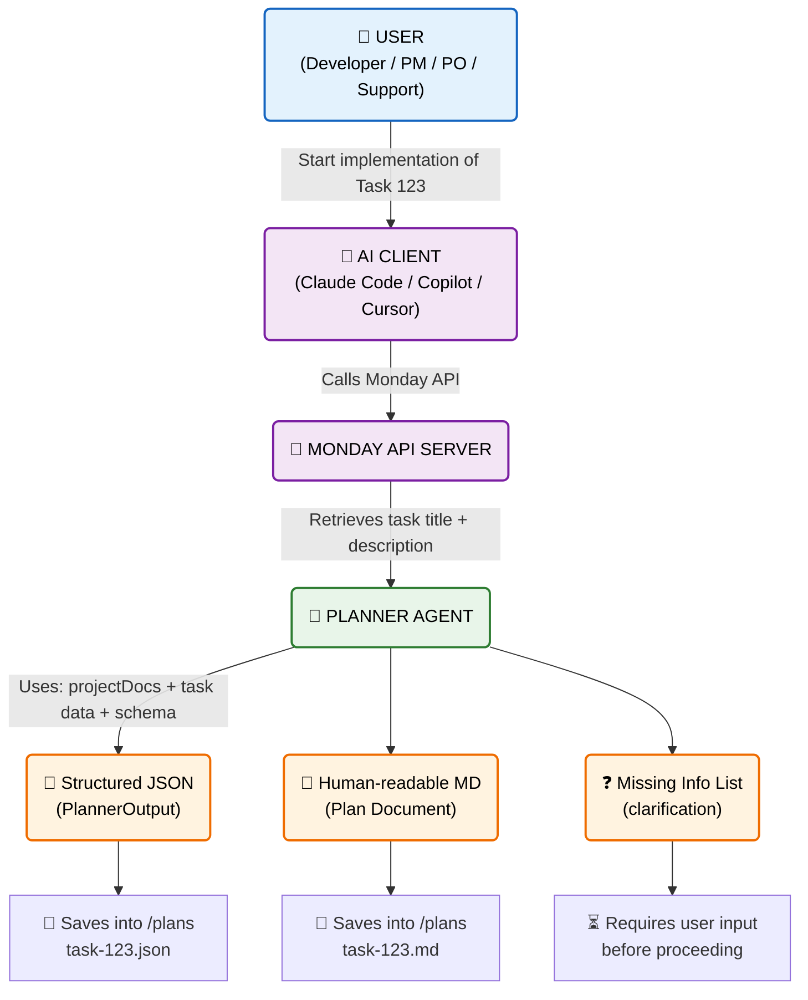

# Mat AI Agent

A specialized AI Planner Agent built with Node.js, TypeScript, and OpenAI. This agent integrates with Monday.com to fetch task details and generates comprehensive implementation plans for frontend development tasks.

## 🚀 Features

-   **AI-Powered Planning**: Uses OpenAI (GPT-4o) to analyze tasks and generate structured implementation plans.
-   **Monday.com Integration**: Directly fetches task titles and descriptions from Monday.com boards using the official SDK.
-   **Context-Aware**: Reads project documentation from the `context/` directory to ensure plans are aligned with the project's architecture and design system.
-   **Structured Output**: Generates JSON plans containing user stories, acceptance criteria, scope, implementation steps, and test cases.
-   **Developer Experience**: Built with TypeScript, strict type safety, and alias imports for clean code.

## 🛠️ Tech Stack

-   **Runtime**: Node.js
-   **Language**: TypeScript
-   **AI**: OpenAI API
-   **Integration**: Monday.com API SDK

## 📋 Prerequisites

-   Node.js (v18 or higher)
-   npm
-   An OpenAI API Key
-   A Monday.com API Token

## ⚙️ Installation

1.  **Clone the repository:**
    ```bash
    git clone <repository-url>
    cd mat-ai-agent
    ```

2.  **Install dependencies:**
    ```bash
    npm install
    ```

3.  **Configure Environment Variables:**
    Copy the example environment file:
    ```bash
    cp .env.example .env
    ```
    Open `.env` and fill in your API keys:
    ```env
    OPENAI_API_KEY=your_openai_api_key_here
    MONDAY_API_TOKEN=your_monday_api_token_here
    MONDAY_API_URL=https://api.monday.com/v2
    ```

## 🏃‍♂️ Usage

### Development Mode
To run the planner agent directly with `tsx`:

```bash
npm run dev -- --taskId=<MONDAY_TASK_ID>
```

### Production Build
To build and run the compiled JavaScript:

1.  **Build the project:**
    ```bash
    npm run build
    ```

2.  **Run the planner:**
    ```bash
    npm run planner -- --taskId=<MONDAY_TASK_ID>
    ```

### Output
The agent will generate a JSON plan in the `plans/` directory, named `task-<TASK_ID>.json`.

## 📂 Project Structure

```
.
├── context/             # Project documentation (Architecture, Design System)
├── plans/               # Generated implementation plans (JSON)
├── src/
│   ├── agents/          # AI Agent logic (PlannerAgent)
│   ├── config/          # Environment configuration
│   ├── orchestrator/    # CLI entry point
│   ├── prompts/         # Prompt templates
│   ├── retrieval/       # (Future) Code retrieval logic
│   ├── schemas/         # Zod schemas for validation
│   ├── services/        # External service clients (Monday, OpenAI)
│   ├── tools/           # Utilities (Monday API, File System)
│   ├── types/           # TypeScript definitions
│   └── utils/           # Helper functions
├── .env.example         # Environment variables template
├── package.json         # Dependencies and scripts
└── tsconfig.json        # TypeScript configuration
```

## Diagram




## 🗺️ Roadmap

- [ ] **Context Integration**: Get context files directly from the frontend repository.
- [x] **Monday SDK**: Update the Monday.com implementation to use `@mondaydotcomorg/api` instead of raw Axios calls.
- [ ] **Environment Config**: Include the frontend repository path in environment variables for better local integration.
- [ ] **Repo Index**: Convert this repo-index.json into Hashmap later `src/repo/load-repo-files.ts`
- [ ] **ZOD Parsing**: Apply ZOD to parse `repoIndex` from `load-repo-files.ts`


