# Mat AI Agent

A specialized AI Planner Agent built with Node.js, TypeScript, and OpenAI. This agent integrates with Monday.com to fetch task details and generates comprehensive implementation plans for frontend development tasks.

## 🚀 Features

-   **AI-Powered Planning**: Uses OpenAI (GPT-4o) to analyze tasks and generate structured implementation plans.
-   **Monday.com Integration**: Directly fetches task titles and descriptions from Monday.com boards using the official SDK.
-   **Context-Aware**: Reads project documentation from the `context/` directory to ensure plans are aligned with the project's architecture and design system.
-   **Structured Output**: Generates JSON plans containing user stories, acceptance criteria, scope, implementation steps, and test cases.
-   **Developer Experience**: Built with TypeScript, strict type safety, and alias imports for clean code.

## 🛠️ Tech Stack

-   **Runtime**: Node.js
-   **Language**: TypeScript
-   **AI**: OpenAI API
-   **Integration**: Monday.com API SDK

## 📋 Prerequisites

-   Node.js (v18 or higher)
-   npm
-   An OpenAI API Key
-   A Monday.com API Token

## ⚙️ Installation

1.  **Clone the repository:**
    ```bash
    git clone <repository-url>
    cd mat-ai-agent
    ```

2.  **Install dependencies:**
    ```bash
    npm install
    ```

3.  **Configure Environment Variables:**
    Copy the example environment file:
    ```bash
    cp .env.example .env
    ```
    Open `.env` and fill in your API keys:
    ```env
    OPENAI_API_KEY=your_openai_api_key_here
    MONDAY_API_TOKEN=your_monday_api_token_here
    MONDAY_API_URL=https://api.monday.com/v2
    ```

## 🏃‍♂️ Usage

### Development Mode
To run the planner agent directly with `tsx`:

```bash
npm run dev -- --taskId=<MONDAY_TASK_ID>
```

### Production Build
To build and run the compiled JavaScript:

1.  **Build the project:**
    ```bash
    npm run build
    ```

2.  **Run the planner:**
    ```bash
    npm run planner -- --taskId=<MONDAY_TASK_ID>
    ```

### Output
The agent will generate a JSON plan in the `plans/` directory, named `task-<TASK_ID>.json`.

## 📂 Project Structure

```
.
├── context/             # Project documentation (Architecture, Design System)
├── plans/               # Generated implementation plans (JSON)
├── src/
│   ├── agents/          # AI Agent logic (PlannerAgent)
│   ├── config/          # Environment configuration
│   ├── orchestrator/    # CLI entry point
│   ├── prompts/         # Prompt templates
│   ├── retrieval/       # (Future) Code retrieval logic
│   ├── schemas/         # Zod schemas for validation
│   ├── services/        # External service clients (Monday, OpenAI)
│   ├── tools/           # Utilities (Monday API, File System)
│   ├── types/           # TypeScript definitions
│   └── utils/           # Helper functions
├── .env.example         # Environment variables template
├── package.json         # Dependencies and scripts
└── tsconfig.json        # TypeScript configuration
```

## 📚 Context System

The agent uses a context system to understand your project's architecture, design patterns, and conventions. This is powered by the `buildProjectContext` function.

### How It Works

The `buildProjectContext` function (located in `src/utils/build-project-context.ts`) automatically:

1. **Scans** the `context/` directory for all `.md` and `.txt` files
2. **Concatenates** them into a single string with clear file separators
3. **Writes** the combined output to `context/project-context.md`
4. **Returns** the concatenated content for use by the AI agent

### Usage

Simply place your project documentation files in the `context/` directory:

```
context/
├── architecture.md
├── design-system.md
├── coding-standards.txt
└── project-context.md  # Auto-generated output
```

The function will automatically combine all files (except `project-context.md` itself) into a single context document that the AI agent can use.

### Function Signature

```typescript
export function buildProjectContext(): string
```

**Returns**: A string containing all context files concatenated with headers

**Output Format**:
```markdown
### PROJECT CONTEXT

---
# FILE: architecture.md

[content of architecture.md]

---
# FILE: design-system.md

[content of design-system.md]
```

### Manual Build

You can manually rebuild the context file at any time:

```bash
npm run build:project-context
```

### When to Use

- Add new `.md` or `.txt` files to `context/` whenever you want the AI to be aware of specific project conventions
- The function runs automatically when the agent starts
- Run `npm run build:project-context` manually after adding/updating context files
- The generated `project-context.md` file can be reviewed to see what context the AI is using

## 🔧 AI Diff Generation & Patch Application System

The executor agent generates unified diffs to modify files, but LLMs often produce malformed diffs. This system uses a **3-strategy fallback approach** with automatic fixing to achieve 100% success rate.

### The Challenge

LLMs frequently generate diffs with issues:
- ❌ **Wrong line counts** in hunk headers (e.g., header says "14 lines" but includes 50+ lines)
- ❌ **Full-file replacements** instead of targeted hunks
- ❌ **Tab/space conversion** (changes indentation unintentionally)
- ❌ **Too much context** (includes entire file instead of 3 lines before/after)

### The Solution: 3-Strategy Fallback System


### Utility Functions Architecture

```mermaid
flowchart LR
    subgraph "normalize-diff.ts"
        normalizeDiff[normalizeDiff<br/>Main orchestrator]
        
        isFullFile[isFullFileDiff<br/>Detects full-file diffs]
        extract[extractContentFromDiff<br/>Extracts old/new content]
        detectIndent[detectIndentation<br/>Detects tabs vs spaces]
        convertTabs[convertSpacesToTabs<br/>Fixes whitespace]
        
        normalizeDiff --> isFullFile
        isFullFile -->|Yes| extract
        extract --> createPatch[createTwoFilesPatch<br/>from diff library]
        createPatch --> normalizeDiff
        
        normalizeDiff --> detectIndent
        detectIndent --> convertTabs
        convertTabs --> normalizeDiff
    end
    
    subgraph "apply-patch-safe.ts"
        applyPatch[applyPatchWithFallback<br/>3-strategy application]
        
        applyPatch --> Strategy1[Strategy 1:<br/>Original diff]
        applyPatch --> Strategy2[Strategy 2:<br/>Fixed diff]
        applyPatch --> Strategy3[Strategy 3:<br/>patch command]
        
        Strategy2 --> normalizeDiff
    end
    
    LLM[AI generates diff] --> applyPatch
    applyPatch --> Result[✅ Applied patch]
    
    style normalizeDiff fill:#e8f5e9,stroke:#2e7d32,stroke-width:3px
    style applyPatch fill:#e3f2fd,stroke:#1565c0,stroke-width:3px
    style LLM fill:#fff3e0,stroke:#ef6c00
    style Result fill:#e8f5e9,stroke:#2e7d32
```



### Success Rates

| Approach | Success Rate | Notes |
|----------|--------------|-------|
| **Strategy 1 only** (raw diff) | ~30% | LLM diffs often malformed |
| **Strategy 1 + 2** (with auto-fix) | ~95% | Handles most issues |
| **Strategy 1 + 2 + 3** (all strategies) | ~100% | `patch` command is very forgiving |

### Key Functions

#### `normalizeDiff(diff: string, originalContent: string): string`
Main orchestrator that:
1. Detects full-file diffs (>70% of file content in one hunk)
2. Regenerates proper hunks using `createTwoFilesPatch()` if needed
3. Fixes indentation (tabs vs spaces)
4. Corrects hunk header line counts

#### `applyPatchWithFallback(originalContent, diff, filePath)`
Tries three strategies in order:
1. Apply original diff with `diff` library
2. Auto-fix diff and apply with `diff` library
3. Use Unix `patch` command with `--ignore-whitespace`

### Why Keep These Functions?

**Q: Can we remove the utility functions and rely only on the LLM prompt?**

**A: No.** Here's why:

- 🎲 **LLMs are non-deterministic** - Even with perfect prompts, they make mistakes
- 📊 **Success rate**: 100% WITH auto-fix vs ~70% without
- 🛡️ **Defensive programming** - Better to have safety nets than rely on AI perfection
- 🔄 **Real-world data**: In testing, Strategy 1 (raw diff) never succeeded; auto-fix was always needed

**Architecture:**
```
Improved Prompt (70% success) + Auto-fix (30% rescue) = 100% success ✅
```

### Current Limitations

The current system works great for **modifying existing files** but has limitations:

- ❌ **Creating new files** - Unified diff format requires an existing file
- ❌ **Deleting files** - Not supported by unified diff
- ❌ **Moving/renaming files** - Would appear as delete + create
- ⚠️ **Full file replacements** - Works but inefficient (regenerates entire diff)

See [TODO](#-todo) section for planned enhancements.

## Diagram

```mermaid
flowchart TD
    %% ======================
    %% ACTORS
    %% ======================
    User("👤 USER<br/>(Developer / PM / PO / Support)")
    AIClient("🤖 AI CLIENT<br/>(Claude Code / Copilot / Cursor)")
    MondayAPI("📅 MONDAY API SERVER")

    %% ======================
    %% PHASE 1 — PLANNER
    %% ======================
    PlannerAgent("🧠 PLANNER AGENT<br/>(Phase 1)")
    
    JSON("📄 Planner JSON<br/>(plan.json)")
    MD("📝 Planner MD<br/>(plan.md)")
    Missing("❓ Missing Info<br/>(Clarifications)")

    %% ======================
    %% PHASE 2 — EXECUTOR
    %% ======================
    ExecutionOrchestrator("⚙️ EXECUTION ORCHESTRATOR<br/>(runExecution)")
    FileLoader("📂 FILE LOADER<br/>(repo-index + loadRepoFiles)")
    ExecutorAgent("🤖 EXECUTOR AGENT<br/>(Diff Generator)")
    
    Diffs("🧩 Unified Diffs<br/>(.patch files)")
    Metadata("🗂 Execution Metadata<br/>(metadata.json)")

    %% ======================
    %% PHASE 2.5 — APPLY
    %% ======================
    ApplyPatches("🛠 PATCH APPLIER<br/>(runApply)")
    Repo("📁 FRONTEND REPOSITORY<br/>(Real Codebase)")
    Backup("💾 Backup Files<br/>(.backup)")

    %% ======================
    %% FLOW
    %% ======================
    User -->|"Start implementation of Task 123"| AIClient
    AIClient -->|"Fetch task data"| MondayAPI
    MondayAPI -->|"Task title + description"| PlannerAgent

    PlannerAgent -->|"Generate structured plan"| JSON
    PlannerAgent -->|"Generate human-readable plan"| MD
    PlannerAgent -->|"If needed"| Missing

    JSON -->|"Input"| ExecutionOrchestrator
    MD -->|"Reference"| ExecutionOrchestrator

    ExecutionOrchestrator -->|"Validate paths"| FileLoader
    FileLoader -->|"Load real files"| ExecutionOrchestrator

    ExecutionOrchestrator -->|"Plan + Context + Files"| ExecutorAgent
    ExecutorAgent -->|"Generate diffs"| Diffs

    ExecutionOrchestrator -->|"Save"| Metadata

    Diffs --> ApplyPatches
    ApplyPatches -->|"Apply safely"| Repo
    ApplyPatches -->|"Create backup"| Backup

    %% ======================
    %% STYLING
    %% ======================
    classDef user fill:#e3f2fd,stroke:#1565c0,stroke-width:2px,color:#000
    classDef system fill:#f3e5f5,stroke:#7b1fa2,stroke-width:2px,color:#000
    classDef agent fill:#e8f5e9,stroke:#2e7d32,stroke-width:2px,color:#000
    classDef output fill:#fff3e0,stroke:#ef6c00,stroke-width:2px,color:#000
    classDef execution fill:#ede7f6,stroke:#5e35b1,stroke-width:2px,color:#000
    classDef repo fill:#fce4ec,stroke:#ad1457,stroke-width:2px,color:#000

    class User user
    class AIClient,MondayAPI system
    class PlannerAgent,ExecutorAgent agent
    class JSON,MD,Missing,Diffs,Metadata output
    class ExecutionOrchestrator,FileLoader,ApplyPatches execution
    class Repo,Backup repo
```




## 🗺️ TODO

### High Priority
- [ ] **Context Integration**: Get context files directly from the frontend repository.
- [ ] **Environment Config**: Include the frontend repository path in environment variables for better local integration.
- [ ] **Generated files**: Create a new folder called `generated` and move all generated files there. Files like planned, context, plans, repo-index.json, etc...
- [ ] **Update Execution Task Id**: Update the `run-execution.ts` to use the task id to create folders, instead of random id.

### Executor Enhancements (Complex Tasks Support)

**Current limitation:** The executor only supports `modify` operations (unified diffs). For complex tasks, we need to support additional file operations.

**Proposed enhancement:** Extend `ExecutorOutput` schema to support multiple operation types:

```typescript
export type FileOperation = 
  | { type: 'modify'; path: string; diff: string }           // Current: modify existing files
  | { type: 'create'; path: string; content: string }        // New: create new files
  | { type: 'delete'; path: string }                         // New: delete files
  | { type: 'move'; from: string; to: string }               // New: move/rename files
  | { type: 'replace'; path: string; content: string };      // New: full file replacement

export type ExecutorOutput = {
    summary: string;
    operations: FileOperation[];  // Changed from 'modifications'
    missingInformation: string[];
    confidence: number;
};
```

**Tasks:**
- [ ] **Extend ExecutorOutput schema** - Add support for different operation types
- [ ] **Update executor prompt** - Teach AI to use different operation types
- [ ] **Implement create operation** - Handle file creation
- [ ] **Implement delete operation** - Handle file deletion
- [ ] **Implement move operation** - Handle file moving/renaming
- [ ] **Implement replace operation** - Handle full file replacements efficiently
- [ ] **Update apply-patch logic** - Handle all operation types in patch application
- [ ] **Add validation** - Ensure operations are safe (e.g., don't delete critical files)


**Benefits:**
- ✅ Support creating new components/files
- ✅ Support deleting obsolete files
- ✅ Support refactoring (moving files)
- ✅ More efficient full file replacements
- ✅ Better handling of complex multi-file tasks

### Code Quality
- [ ] **Repo Index**: Convert this repo-index.json into Hashmap later `src/repo/load-repo-files.ts`
- [ ] **ZOD Parsing**: Apply ZOD to parse `repoIndex` from `load-repo-files.ts`
- [ ] **Review context context**: Check if the name from `/context` files is the best name for the file. Keep all files with original names and generated a new one called `merged-context.md`
- [ ] **Generated files**: Create a new folder called `generated` and move all generated files there. Files like planned, context, plans, repo-index.json, etc...
- [ ] **Update Execution Task Id**: Update the `run-execution.ts` to use the task id to create folders, instead of random id.

### Completed
- [x] **Monday SDK**: Update the Monday.com implementation to use `@mondaydotcomorg/api` instead of raw Axios calls.

## Fix
- In planner it's read all `/context` to create the planner, but it will use the `project-context.md` that already have all concatenated files, also... why we need to generate a new merged context file later if in the planner we can generate `project-context.md` ?